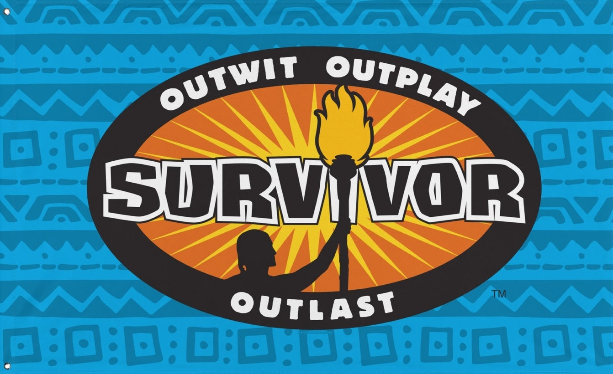
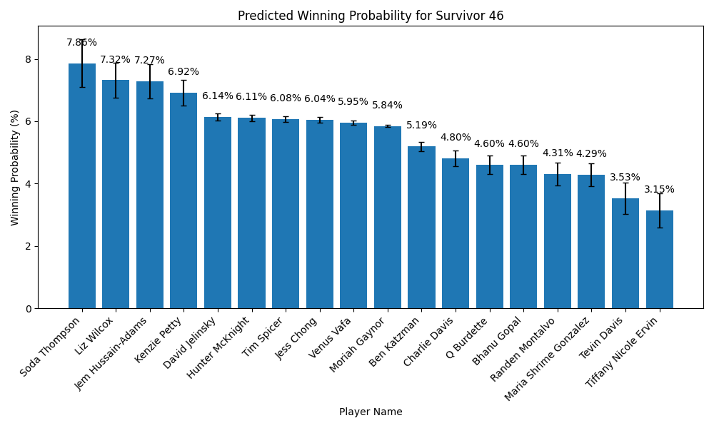
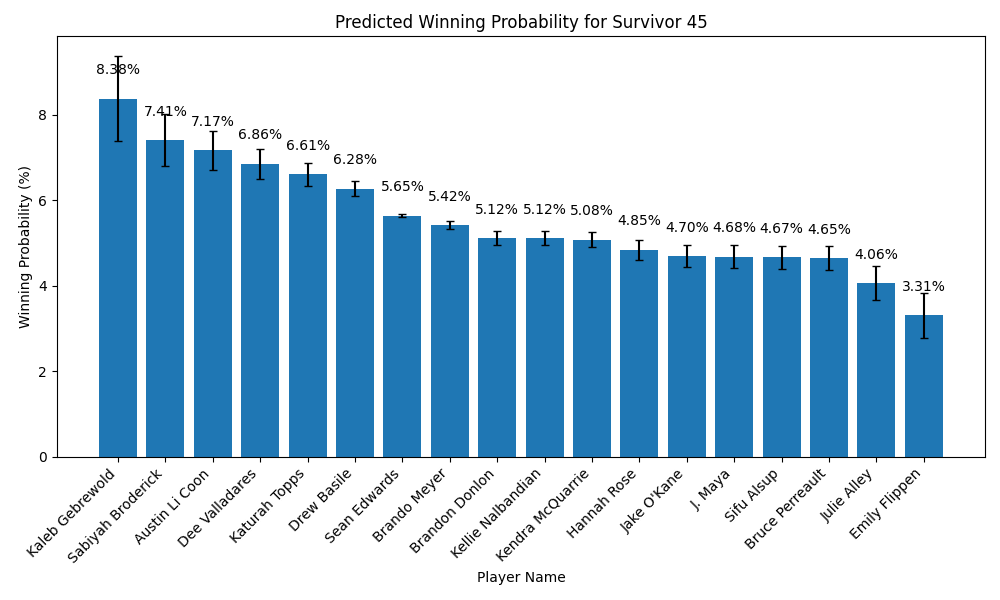

# Survivor Predictor Model 

Using AI to predict the winner of the popular CBS gameshow survivor!

## Survivor: 46 Prediction

The algorithm predicts Soda to win Survivor: 46! The model predicts 4 clear likely winners: Soda, Liz, Gem, and Kenzie.

## The Model

### How does it work?

1. Scrape Survivor information from the [Survivor Wikipedia](https://survivor.fandom.com/wiki). This player-level information includes:
    * Age
    * Hometown (not currently used)
    * Occupation
    * Self-reported pre-game description
2. Embed the text information with an embedding model (GPT 3). 
    * These models are able to extract meaning from chunks of text and convert them to numbers that contain that meaning. For an explanation on embedding models, check out [this IBM post](https://www.ibm.com/topics/embedding).
3. Train the final model and predict on the newest season.

### What goes into the model?

The model predicts using these variables:
* Player age
* Player occupation (embedding)
* Player description (embedding)
* Number of days in the season
* Season number (to capture high-level changes over time)

### Model Details

After testing various methods in the [model test file]("./model/model_test.py"), I selected a support vector machine (SVM) as my final predictive model. The parameters of this model are:
* Kernel: Linear
* C: 10
* Weights: Winner = 15x; Non-Winner = 1x

Model details can be found in the [model utilities file]("./model/model_utils.py). The final predictions (and standard deviations) are the averages from 1000 bootstrap runs of the model.

## Past Predictions

### Survivor: 45

